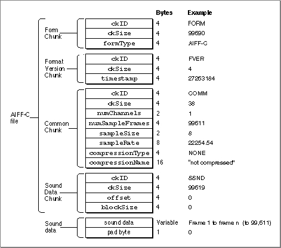

AIFF format is a single FORM chunk built out of lots of other 'local' chunks. Most are entirely optional, some can appear multiple times and they can appear in any order. It's worth mentioning that AIFF format is uncompressed and a separate AIFC format exists which does use compression.

This format was fairly easy to implement as there is a PDF file describing the format in its entirety. A copy of it can be found [here](/docs/formats/aiff/AIFF-1.3.pdf) and it REALLY clears some things up. That being said, this format is pretty old by now and comes with it's own unique list of troubles.

The biggest offender was the sample rate field which is stored in an IEEE 754 extended precision format. But not exactly. This is actually the SANE 'extended' data type present on the older Macintosh environments. Now, there is a good reason the data type existed in the environment due to how these were processed by the machines. But I, for the life of me, can not understand why would you encode an audio sample rate value using this specific data type. It's always whole and the value range shouldn't ever exceed 64 bits (and that is exaggerated). I've read somewhere that the format could be extended beyond audio by using this type, but I've got no samples to back that claim up. Golang does not provide a data type for the extended precision floats so I resorted to writing my own type for it.

Since Go does not include such data type, it had to be implemented. After some digging I stumbled upon the "[Standard Apple Numerics Environment Manual](/docs/formats/aiff/Standard Apple Numerics Environment Manual.pdf)" which describes the data types implemented in SANE, including the 'extended' data type (Page 17):

SANE extended data type appears to conform to [IEEE 754 x86 extended precision floating point format](https://en.wikipedia.org/wiki/Extended_precision#Extended_precision_implementations), therefore it can be implemented as such. The `Extended` container was implemented which can get/set the type using float64/bytes. I've decided to implement the byte to float64 conversion exactly as specified in the SANE manual. [mewmew's implementation of float80](https://github.com/mewspring/mewmew-l/blob/c756be720bb0/internal/float80/float80.go) has also helped me implement the float64 to byte logic.

Some local chunks store text in one field and provide a separate field which specifies the length for the text. But the marker chunk, for example, uses a pascal style string (first byte is the length of the text, the rest is the text itself). Chunks with variable length have to be padded with a zero byte in order for each chunk to be of even length. In the end, each AIFF file is even in size.

Here are some additional links I found helpful:
- http://soundfile.sapp.org/doc/WaveFormat/ 
- https://docs.fileformat.com/audio/aiff/