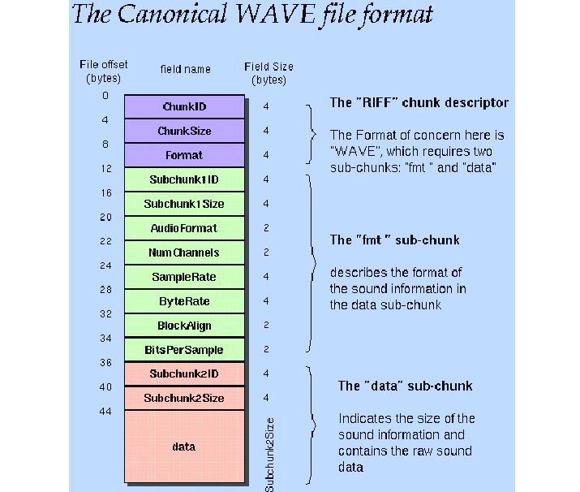

WAVE format is straightforward - a single RIFF chunk which holds an 'fmt' chunk (audio information) an a 'data' chunk (samples). This format is lossless - it stores the samples without any kind of compression. NOTE: there appears to be support for compressed WAVE files judging by the 'audioFormat' field, but this codec does not read them.

It's important to note that all of the data besides the FourCC headers are stored in little endian form. Besides the structure PNG above and some gooling, there's little documentation on this format. There are more chunks which can be present, but I could barely find documentation for those thus I've decided against trying to implement them all. The additional chunks are outside of the canonical form. The codec skips over any chunks it does not recognize.

The frustration with documentation does not end there. Which bitrates does WAV support? Good question! I have no idea. It does seem to work with 8, 16, 32 and even 12 bit samples. I tried multiple online audio converters to convert 12 bit AIFF to WAV and some resorted to just convert the bitrate to 16.

Here are some additional links I found helpful:
- http://soundfile.sapp.org/doc/WaveFormat/ 
- https://docs.fileformat.com/audio/wav/ (although this is a surface level documentation which outright skips over some important nuances -_-)